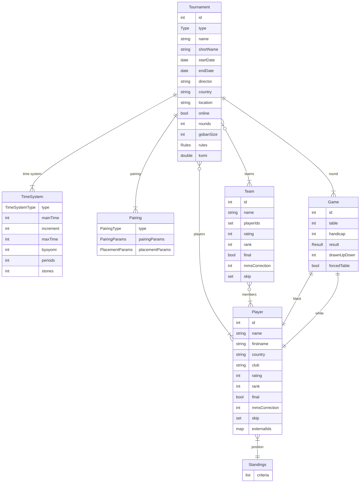

# Pairgoth Model

## Entity Relationship Diagram

## Tournament

Sealed class hierarchy for different tournament formats.

| Field | Type | Description |
|-------|------|-------------|
| id | int | Tournament identifier |
| type | Type | Tournament format |
| name | string | Full tournament name |
| shortName | string | Abbreviated name |
| startDate | date | Start date |
| endDate | date | End date |
| director | string | Tournament director |
| country | string | Country code (default: "fr") |
| location | string | Venue location |
| online | bool | Is online tournament |
| rounds | int | Total number of rounds |
| gobanSize | int | Board size (default: 19) |
| rules | Rules | Scoring rules |
| komi | double | Komi value (default: 7.5) |
| timeSystem | TimeSystem | Time control |
| pairing | Pairing | Pairing system |
| tablesExclusion | list | Table exclusion rules per round |

### Tournament Types

| Type | Players/Team | Description |
|------|--------------|-------------|
| INDIVIDUAL | 1 | Individual players |
| PAIRGO | 2 | Pair Go (alternating) |
| RENGO2 | 2 | Rengo with 2 players |
| RENGO3 | 3 | Rengo with 3 players |
| TEAM2 | 2 | Team with 2 boards |
| TEAM3 | 3 | Team with 3 boards |
| TEAM4 | 4 | Team with 4 boards |
| TEAM5 | 5 | Team with 5 boards |

### Rules

- `AGA` - American Go Association
- `FRENCH` - French Go Association
- `JAPANESE` - Japanese rules
- `CHINESE` - Chinese rules

## Player

Individual tournament participant.

| Field | Type | Description |
|-------|------|-------------|
| id | int | Player identifier |
| name | string | Last name |
| firstname | string | First name |
| country | string | Country code |
| club | string | Club affiliation |
| rating | int | EGF-style rating |
| rank | int | Rank (-30=30k to 8=9D) |
| final | bool | Is registration confirmed |
| mmsCorrection | int | MacMahon score correction |
| skip | set | Skipped round numbers |
| externalIds | map | External IDs (AGA, EGF, FFG) |

## Team

Team participant (for team tournaments).

| Field | Type | Description |
|-------|------|-------------|
| id | int | Team identifier |
| name | string | Team name |
| playerIds | set | Member player IDs |
| rating | int | Computed from members |
| rank | int | Computed from members |
| final | bool | Is registration confirmed |
| mmsCorrection | int | MacMahon score correction |
| skip | set | Skipped round numbers |

## Game

Single game in a round.

| Field | Type | Description |
|-------|------|-------------|
| id | int | Game identifier |
| table | int | Table number (0 = unpaired) |
| white | int | White player ID (0 = bye) |
| black | int | Black player ID (0 = bye) |
| handicap | int | Handicap stones |
| result | Result | Game outcome |
| drawnUpDown | int | DUDD value |
| forcedTable | bool | Is table manually assigned |

### Result

| Code | Description |
|------|-------------|
| ? | Unknown (not yet played) |
| w | White won |
| b | Black won |
| = | Jigo (draw) |
| X | Cancelled |
| # | Both win (unusual) |
| 0 | Both lose (unusual) |

## TimeSystem

Time control configuration.

| Field | Type | Description |
|-------|------|-------------|
| type | TimeSystemType | System type |
| mainTime | int | Main time in seconds |
| increment | int | Fischer increment |
| maxTime | int | Fischer max time |
| byoyomi | int | Byoyomi time per period |
| periods | int | Number of byoyomi periods |
| stones | int | Stones per period (Canadian) |

### TimeSystemType

| Type | Description |
|------|-------------|
| CANADIAN | Canadian byoyomi |
| JAPANESE | Japanese byoyomi |
| FISCHER | Fischer increment |
| SUDDEN_DEATH | No overtime |

## Pairing

Pairing system configuration.

### Pairing Types

| Type | Description |
|------|-------------|
| SWISS | Swiss system |
| MAC_MAHON | MacMahon system |
| ROUND_ROBIN | Round robin (not implemented) |

### MacMahon-specific

| Field | Type | Description |
|-------|------|-------------|
| mmFloor | int | MacMahon floor (default: -20 = 20k) |
| mmBar | int | MacMahon bar (default: 0 = 1D) |

### Base Parameters

| Parameter | Description |
|-----------|-------------|
| nx1 | Concavity curve factor (0.0-1.0) |
| dupWeight | Duplicate game avoidance weight |
| random | Randomization factor |
| deterministic | Deterministic pairing |
| colorBalanceWeight | Color balance importance |
| byeWeight | Bye assignment weight |

### Main Parameters

| Parameter | Description |
|-----------|-------------|
| categoriesWeight | Avoid mixing categories |
| scoreWeight | Minimize score differences |
| drawUpDownWeight | Draw-up/draw-down weighting |
| compensateDrawUpDown | Enable DUDD compensation |
| drawUpDownUpperMode | TOP, MIDDLE, or BOTTOM |
| drawUpDownLowerMode | TOP, MIDDLE, or BOTTOM |
| seedingWeight | Seeding importance |
| lastRoundForSeedSystem1 | Round cutoff for system 1 |
| seedSystem1 | First seeding method |
| seedSystem2 | Second seeding method |
| mmsValueAbsent | MMS for absent players |
| roundDownScore | Floor vs round scores |

### Seed Methods

- `SPLIT_AND_FOLD`
- `SPLIT_AND_RANDOM`
- `SPLIT_AND_SLIP`

### Secondary Parameters

| Parameter | Description |
|-----------|-------------|
| barThresholdActive | Don't apply below bar |
| rankSecThreshold | Rank limit for criteria |
| nbWinsThresholdActive | Score threshold |
| defSecCrit | Secondary criteria weight |

### Geographical Parameters

| Parameter | Description |
|-----------|-------------|
| avoidSameGeo | Avoid same region |
| preferMMSDiffRatherThanSameCountry | Country preference |
| preferMMSDiffRatherThanSameClubsGroup | Club group preference |
| preferMMSDiffRatherThanSameClub | Club preference |

### Handicap Parameters

| Parameter | Description |
|-----------|-------------|
| weight | Handicap minimization weight |
| useMMS | Use MMS vs rank |
| rankThreshold | Rank threshold |
| correction | Handicap reduction |
| ceiling | Max handicap stones |

## Placement Criteria

Tiebreak criteria for standings, in order of priority.

### Score-based

| Criterion | Description |
|-----------|-------------|
| NBW | Number of wins |
| MMS | MacMahon score |
| STS | Strasbourg score |
| CPS | Cup score |
| SCOREX | Congress score |

### Opponent-based (W = wins, M = MMS)

| Criterion | Description |
|-----------|-------------|
| SOSW / SOSM | Sum of opponent scores |
| SOSWM1 / SOSMM1 | SOS minus worst |
| SOSWM2 / SOSMM2 | SOS minus two worst |
| SODOSW / SODOSM | Sum of defeated opponent scores |
| SOSOSW / SOSOSM | Sum of opponent SOS |
| CUSSW / CUSSM | Cumulative score sum |

### Other

| Criterion | Description |
|-----------|-------------|
| CATEGORY | Player category |
| RANK | Player rank |
| RATING | Player rating |
| DC | Direct confrontation |
| SDC | Simplified direct confrontation |
| EXT | Exploits attempted |
| EXR | Exploits successful |

## External Databases

Player IDs can be linked to external rating databases:

| Database | Description |
|----------|-------------|
| AGA | American Go Association |
| EGF | European Go Federation |
| FFG | French Go Association |
