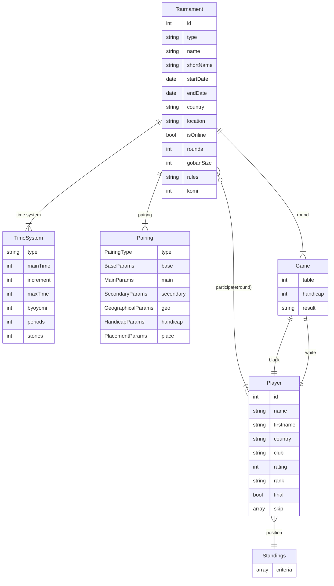

# PairGoth model

## Entity Relationship Diagram

For simplicity, teams (pairgo, rengo) and teams of individuals (clubs championships) are not included.

```mermaid
erDiagram

  %% entities

  Tournament {
    int id
    string type
    string name
    string shortName
    date startDate
    date endDate
    string country
    string location
    bool isOnline
    int rounds
    int gobanSize
    string rules
    int komi
  }

  TimeSystem {
    string type
    int mainTime
    int increment
    int maxTime
    int byoyomi
    int periods
    int stones
  }

  Pairing {
    PairingType type
    BaseParams base
    MainParams main
    SecondaryParams secondary
    GeographicalParams geo
    HandicapParams handicap
    PlacementParams place
  }
  
  Game {
    int table
    int handicap
    string result
  }

  Player {
    int id
    string name
    string firstname
    string country
    string club
    int rating
    string rank
    bool final
    array skip
  }
  
  Standings {
    array criteria
  }

  %% relationships

  Tournament ||--|{ TimeSystem: "time system"
  Tournament ||--|{ Pairing: "pairing"
  Tournament ||--|{ Game: "round"
  Tournament }o--|{ Player: "participate(round)"
  Game ||--|| Player: "black"
  Game ||--|| Player: "white"
  Player }|--|| Standings: "position"
  
```
