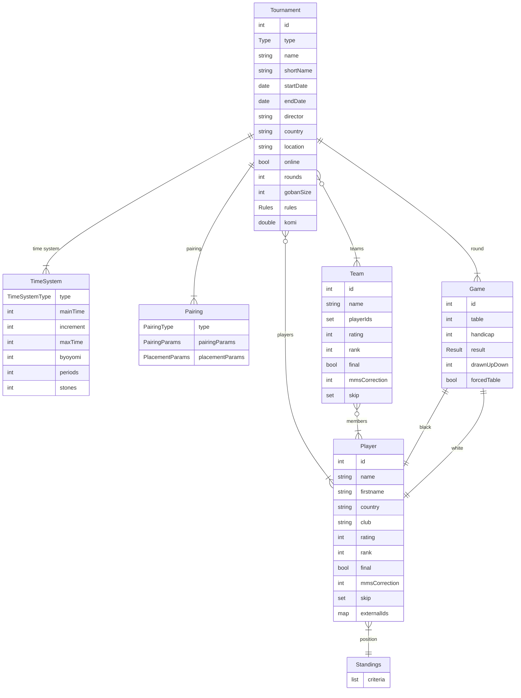

# Pairgoth Reference Documentation

[TOC]

## Pairgoth Model

*Exhaustive classes and fields diagram.*

### Entity Relationship Diagram



### Tournament

Sealed class hierarchy for different tournament formats.

| Field | Type | Description |
|-------|------|-------------|
| id | int | Tournament identifier |
| type | Type | Tournament format |
| name | string | Full tournament name |
| shortName | string | Abbreviated name |
| startDate | date | Start date |
| endDate | date | End date |
| director | string | Tournament director |
| country | string | Country code (default: "fr") |
| location | string | Venue location |
| online | bool | Is online tournament |
| rounds | int | Total number of rounds |
| gobanSize | int | Board size (default: 19) |
| rules | Rules | Scoring rules |
| komi | double | Komi value (default: 7.5) |
| timeSystem | TimeSystem | Time control |
| pairing | Pairing | Pairing system |
| tablesExclusion | list | Table exclusion rules per round |

#### Tournament Types

| Type | Players/Team | Description |
|------|--------------|-------------|
| INDIVIDUAL | 1 | Individual players |
| PAIRGO | 2 | Pair Go (alternating) |
| RENGO2 | 2 | Rengo with 2 players |
| RENGO3 | 3 | Rengo with 3 players |
| TEAM2 | 2 | Team with 2 boards |
| TEAM3 | 3 | Team with 3 boards |
| TEAM4 | 4 | Team with 4 boards |
| TEAM5 | 5 | Team with 5 boards |

#### Rules

- `AGA` - American Go Association
- `FRENCH` - French Go Association
- `JAPANESE` - Japanese rules
- `CHINESE` - Chinese rules

### Player

Individual tournament participant.

| Field | Type | Description |
|-------|------|-------------|
| id | int | Player identifier |
| name | string | Last name |
| firstname | string | First name |
| country | string | Country code |
| club | string | Club affiliation |
| rating | int | EGF-style rating |
| rank | int | Rank (-30=30k to 8=9D) |
| final | bool | Is registration confirmed |
| mmsCorrection | int | MacMahon score correction |
| skip | set | Skipped round numbers |
| externalIds | map | External IDs (AGA, EGF, FFG) |

### Team

Team participant (for team tournaments).

| Field | Type | Description |
|-------|------|-------------|
| id | int | Team identifier |
| name | string | Team name |
| playerIds | set | Member player IDs |
| rating | int | Computed from members |
| rank | int | Computed from members |
| final | bool | Is registration confirmed |
| mmsCorrection | int | MacMahon score correction |
| skip | set | Skipped round numbers |

### Game

Single game in a round.

| Field | Type | Description |
|-------|------|-------------|
| id | int | Game identifier |
| table | int | Table number (0 = unpaired) |
| white | int | White player ID (0 = bye) |
| black | int | Black player ID (0 = bye) |
| handicap | int | Handicap stones |
| result | Result | Game outcome |
| drawnUpDown | int | DUDD value |
| forcedTable | bool | Is table manually assigned |

#### Result

| Code | Description |
|------|-------------|
| ? | Unknown (not yet played) |
| w | White won |
| b | Black won |
| = | Jigo (draw) |
| X | Cancelled |
| # | Both win (unusual) |
| 0 | Both lose (unusual) |

### TimeSystem

Time control configuration.

| Field | Type | Description |
|-------|------|-------------|
| type | TimeSystemType | System type |
| mainTime | int | Main time in seconds |
| increment | int | Fischer increment |
| maxTime | int | Fischer max time |
| byoyomi | int | Byoyomi time per period |
| periods | int | Number of byoyomi periods |
| stones | int | Stones per period (Canadian) |

#### TimeSystemType

| Type | Description |
|------|-------------|
| CANADIAN | Canadian byoyomi |
| JAPANESE | Japanese byoyomi |
| FISCHER | Fischer increment |
| SUDDEN_DEATH | No overtime |

### Pairing

Pairing system configuration.

#### Pairing Types

| Type | Description |
|------|-------------|
| SWISS | Swiss system |
| MAC_MAHON | MacMahon system |
| ROUND_ROBIN | Round robin (not implemented) |

#### MacMahon-specific

| Field | Type | Description |
|-------|------|-------------|
| mmFloor | int | MacMahon floor (default: -20 = 20k) |
| mmBar | int | MacMahon bar (default: 0 = 1D) |

#### Base Parameters

| Parameter | Description |
|-----------|-------------|
| nx1 | Concavity curve factor (0.0-1.0) |
| dupWeight | Duplicate game avoidance weight |
| random | Randomization factor |
| deterministic | Deterministic pairing |
| colorBalanceWeight | Color balance importance |
| byeWeight | Bye assignment weight |

#### Main Parameters

| Parameter | Description |
|-----------|-------------|
| categoriesWeight | Avoid mixing categories |
| scoreWeight | Minimize score differences |
| drawUpDownWeight | Draw-up/draw-down weighting |
| compensateDrawUpDown | Enable DUDD compensation |
| drawUpDownUpperMode | TOP, MIDDLE, or BOTTOM |
| drawUpDownLowerMode | TOP, MIDDLE, or BOTTOM |
| seedingWeight | Seeding importance |
| lastRoundForSeedSystem1 | Round cutoff for system 1 |
| seedSystem1 | First seeding method |
| seedSystem2 | Second seeding method |
| mmsValueAbsent | MMS for absent players |
| roundDownScore | Floor vs round scores |

#### Seed Methods

- `SPLIT_AND_FOLD`
- `SPLIT_AND_RANDOM`
- `SPLIT_AND_SLIP`

#### Secondary Parameters

| Parameter | Description |
|-----------|-------------|
| barThresholdActive | Don't apply below bar |
| rankSecThreshold | Rank limit for criteria |
| nbWinsThresholdActive | Score threshold |
| defSecCrit | Secondary criteria weight |

#### Geographical Parameters

| Parameter | Description |
|-----------|-------------|
| avoidSameGeo | Avoid same region |
| preferMMSDiffRatherThanSameCountry | Country preference |
| preferMMSDiffRatherThanSameClubsGroup | Club group preference |
| preferMMSDiffRatherThanSameClub | Club preference |

#### Handicap Parameters

| Parameter | Description |
|-----------|-------------|
| weight | Handicap minimization weight |
| useMMS | Use MMS vs rank |
| rankThreshold | Rank threshold |
| correction | Handicap reduction |
| ceiling | Max handicap stones |

### Placement Criteria

Tiebreak criteria for standings, in order of priority.

#### Score-based

| Criterion | Description |
|-----------|-------------|
| NBW | Number of wins |
| MMS | MacMahon score |
| STS | Strasbourg score |
| CPS | Cup score |
| SCOREX | Congress score |

#### Opponent-based (W = wins, M = MMS)

| Criterion | Description |
|-----------|-------------|
| SOSW / SOSM | Sum of opponent scores |
| SOSWM1 / SOSMM1 | SOS minus worst |
| SOSWM2 / SOSMM2 | SOS minus two worst |
| SODOSW / SODOSM | Sum of defeated opponent scores |
| SOSOSW / SOSOSM | Sum of opponent SOS |
| CUSSW / CUSSM | Cumulative score sum |

#### Other

| Criterion | Description |
|-----------|-------------|
| CATEGORY | Player category |
| RANK | Player rank |
| RATING | Player rating |
| DC | Direct confrontation |
| SDC | Simplified direct confrontation |
| EXT | Exploits attempted |
| EXR | Exploits successful |

### External Databases

Player IDs can be linked to external rating databases:

| Database | Description |
|----------|-------------|
| AGA | American Go Association |
| EGF | European Go Federation |
| FFG | French Go Association |

## Configuration

*How to tune the `pairgoth.properties` file.*

Pairgoth general configuration is done using the `pairgoth.properties` file in the installation folder.

Properties are loaded in this order (later overrides earlier):

1. Default properties embedded in WAR/JAR
2. User properties file (`./pairgoth.properties`) in current working directory
3. System properties prefixed with `pairgoth.` (command-line: `-Dpairgoth.key=value`)

### Environment

Controls the running environment.

```
env = prod
```

Values:
- `dev` - Development mode: enables CORS headers and additional logging
- `prod` - Production: for distributed instances

### Mode

Running mode for the application.

```
mode = standalone
```

Values:
- `standalone` - Both web and API in a single process (default for jar execution)
- `server` - API only
- `client` - Web UI only (connects to remote API)

### Authentication

Authentication method for the application.

```
auth = none
```

Values:
- `none` - No authentication required
- `sesame` - Shared unique password
- `oauth` - Email and/or OAuth accounts

#### Shared secret

When running in client or server mode with authentication enabled:

```
auth.shared_secret = <16 ascii characters string>
```

This secret is shared between API and View webapps. Auto-generated in standalone mode.

#### Sesame password

When using sesame authentication:

```
auth.sesame = <password>
```

### OAuth configuration

When using OAuth authentication:

```
oauth.providers = ffg,google,facebook
```

Comma-separated list of enabled providers: `ffg`, `facebook`, `google`, `instagram`, `twitter`

For each enabled provider, configure credentials:

```
oauth.<provider>.client_id = <client_id>
oauth.<provider>.secret = <client_secret>
```

Example:
```
oauth.ffg.client_id = your-ffg-client-id
oauth.ffg.secret = your-ffg-client-secret
oauth.google.client_id = your-google-client-id
oauth.google.secret = your-google-client-secret
```

### Webapp connector

Pairgoth webapp (UI) connector configuration.

```
webapp.protocol = http
webapp.host = localhost
webapp.port = 8080
webapp.context = /
webapp.external.url = http://localhost:8080
```

- `webapp.host` (or `webapp.interface`) - Hostname/interface to bind to
- `webapp.external.url` - External URL for OAuth redirects and client configuration

### API connector

Pairgoth API connector configuration.

```
api.protocol = http
api.host = localhost
api.port = 8085
api.context = /api
api.external.url = http://localhost:8085/api
```

Note: In standalone mode, API port defaults to 8080 and context to `/api/tour`.

### SSL/TLS configuration

For HTTPS connections:

```
webapp.ssl.key = path/to/localhost.key
webapp.ssl.cert = path/to/localhost.crt
webapp.ssl.pass = <key passphrase>
```

Supports `jar:` URLs for embedded resources.

### Store

Persistent storage for tournaments.

```
store = file
store.file.path = tournamentfiles
```

Values for `store`:
- `file` - Persistent XML files (default)
- `memory` - RAM-based (mainly for tests)

The `store.file.path` is relative to the current working directory.

### Ratings

#### Ratings directory

```
ratings.path = ratings
```

Directory for caching downloaded ratings files.

#### Rating sources

For each rating source (`aga`, `egf`, `ffg`):

```
ratings.<source> = <url>
```

URL override for the rating source. Schemes: `http://`, `https://`, `file://`. If not set, the built-in default URL for that source is used:

- FFG: https://ffg.jeudego.org/echelle/echtxt/ech_ffg_V3.txt
- EGF: https://www.europeangodatabase.eu/EGD/EGD_2_0/downloads/allworld_lp.html

Use this to point at a local mirror or to a static file when the upstream is unreachable.

#### Ratings freeze

```
ratings.date = YYYY-MM-DD
```

Upper bound for the ratings snapshot to use, applied globally to all sources. Designed for multi-day events where ratings must not drift mid-tournament.

Behaviour:
- `ratings.date` not set, or today is before it: dynamic — latest ratings are fetched as usual.
- Today is on or after `ratings.date`: load the most recent cached snapshot whose date is ≤ `ratings.date`. Cache files past the freeze are kept on disk but ignored at load time.
- Until a cached snapshot dated ≥ `ratings.date` exists, hourly fetches continue (so the cache grows toward the freeze date). Once one exists, fetches stop for that source.
- Set in advance and forget: configure on day -N, freeze takes effect automatically on day 0.

#### Enable/disable ratings

```
ratings.<source>.enable = true | false
```

Whether to display the rating source button in the Add Player popup.

```
ratings.<source>.show = true | false
```

Whether to show player IDs from this rating source on the registration page.

Defaults:
- For tournaments in France: FFG enabled and shown by default
- Otherwise: all disabled by default

### SMTP

SMTP configuration for email notifications. Not yet functional.

```
smtp.sender = sender@example.com
smtp.host = smtp.example.com
smtp.port = 587
smtp.user = username
smtp.password = password
```

### Logging

Logging configuration.

```
logger.level = info
logger.format = [%level] %ip [%logger] %message
```

Log levels: `trace`, `debug`, `info`, `warn`, `error`

Format placeholders: `%level`, `%ip`, `%logger`, `%message`

### Webhook

Pairgoth can push content (pairings, results, standings) to an external
tournament website, and pull registered players from it. See
[Pairgoth Webhook specification](#pairgoth-webhook-specification) for the
endpoint contract a consumer must implement.

```
webhook.url    = https://my-tournament-site.example/api/pairgoth
webhook.secret = a-shared-secret
```

- `webhook.url` — base URL of the consumer's pairgoth-integration endpoint.
- `webhook.secret` — shared secret sent on every request as `X-Pairgoth-Secret` header

Behavior:

- If `webhook.url` is **unset or blank**, no webhook integration runs and the
  related UI buttons (Sync from website, Publish pairings/results/standings)
  are not shown.
- If `webhook.url` is set, pairgoth performs a `GET /health` against it at
  startup. **A failed health check is a fatal startup error** — the
  assumption being that the tournament site is supposed to already be running
  when the tournament director launches pairgoth.

### Example configurations

#### Standalone development

```properties
env = dev
mode = standalone
auth = none
store = file
store.file.path = tournamentfiles
logger.level = trace
```

#### Client-server deployment

**Server (API):**
```properties
env = prod
mode = server
auth = oauth
auth.shared_secret = 1234567890abcdef
api.port = 8085
store = file
store.file.path = /var/tournaments
logger.level = info
```

**Client (Web UI):**
```properties
env = prod
mode = client
auth = oauth
auth.shared_secret = 1234567890abcdef
oauth.providers = ffg,google
oauth.ffg.client_id = your-ffg-id
oauth.ffg.secret = your-ffg-secret
oauth.google.client_id = your-google-id
oauth.google.secret = your-google-secret
webapp.port = 8080
api.external.url = http://api-server:8085/api
```

## Pairgoth API specification

*To develop your own tools.*

### General remarks

The API expects an `Accept` header of `application/json`, with no encoding or an `UTF-8` encoding. Exceptions are some export operations which can have different MIME types to specify the expected format:
- `application/json` - JSON output (default)
- `application/xml` - OpenGotha XML export
- `application/egf` - EGF format
- `application/ffg` - FFG format
- `text/csv` - CSV format

GET requests return either an array or an object, as specified below.

POST, PUT and DELETE requests return either the 200 HTTP code with `{ "success": true }` (with an optional `"id"` field for some POST requests), or an invalid HTTP code and (for some errors) the body `{ "success": false, "error": <error message> }`.

All POST/PUT/DELETE requests use read/write locks for concurrency. GET requests use read locks.

When authentication is enabled, all requests require an `Authorization` header.

### Synopsis

+ /api/tour                  GET POST            Tournaments handling
+ /api/tour/#tid             GET PUT DELETE      Tournaments handling
+ /api/tour/#tid/part        GET POST            Registration handling
+ /api/tour/#tid/part/#pid   GET PUT DELETE      Registration handling
+ /api/tour/#tid/team        GET POST            Team handling
+ /api/tour/#tid/team/#tid   GET PUT DELETE      Team handling
+ /api/tour/#tid/pair/#rn    GET POST PUT DELETE Pairing
+ /api/tour/#tid/res/#rn     GET PUT DELETE      Results
+ /api/tour/#tid/standings   GET PUT             Standings
+ /api/tour/#tid/stand/#rn   GET                 Standings
+ /api/tour/#tid/explain/#rn GET                 Pairing explanation
+ /api/token                 GET POST DELETE     Authentication

### Tournament handling

+ `GET /api/tour` Get a list of known tournaments ids

    *output* json map (id towards shortName) of known tournaments

+ `GET /api/tour/#tid` Get the details of tournament #tid

    *output* json object for tournament #tid

    Supports `Accept: application/xml` to get OpenGotha XML export.

+ `POST /api/tour` Create a new tournament

    *input* json object for new tournament, or OpenGotha XML with `Content-Type: application/xml`

    Tournament JSON structure:
    ```json
    {
      "type": "INDIVIDUAL",
      "name": "Tournament Name",
      "shortName": "TN",
      "startDate": "2024-01-15",
      "endDate": "2024-01-16",
      "country": "fr",
      "location": "Paris",
      "online": false,
      "rounds": 5,
      "gobanSize": 19,
      "rules": "FRENCH",
      "komi": 7.5,
      "timeSystem": { ... },
      "pairing": { ... }
    }
    ```

    Tournament types: `INDIVIDUAL`, `PAIRGO`, `RENGO2`, `RENGO3`, `TEAM2`, `TEAM3`, `TEAM4`, `TEAM5`

    *output* `{ "success": true, "id": #tid }`

+ `PUT /api/tour/#tid` Modify a tournament

    *input* json object for updated tournament (only id and updated fields required)

    *output* `{ "success": true }`

+ `DELETE /api/tour/#tid` Delete a tournament

    *output* `{ "success": true }`

### Players handling

+ `GET /api/tour/#tid/part` Get a list of registered players

    *output* json array of known players

+ `GET /api/tour/#tid/part/#pid` Get registration details for player #pid

    *output* json object for player #pid

+ `POST /api/tour/#tid/part` Register a new player

    *input*
    ```json
    {
      "name": "Lastname",
      "firstname": "Firstname",
      "rating": 1500,
      "rank": -5,
      "country": "FR",
      "club": "Club Name",
      "final": true,
      "mmsCorrection": 0,
      "egfId": "12345678",
      "ffgId": "12345",
      "agaId": "12345"
    }
    ```

    Rank values: -30 (30k) to 8 (9D). Rating in EGF-style (100 = 1 stone).

    *output* `{ "success": true, "id": #pid }`

+ `PUT /api/tour/#tid/part/#pid` Modify a player registration

    *input* json object for updated registration (only id and updated fields required)

    *output* `{ "success": true }`

+ `DELETE /api/tour/#tid/part/#pid` Delete a player registration

    *output* `{ "success": true }`

### Teams handling

For team tournaments (PAIRGO, RENGO2, RENGO3, TEAM2-5).

+ `GET /api/tour/#tid/team` Get a list of registered teams

    *output* json array of known teams

+ `GET /api/tour/#tid/team/#teamid` Get registration details for team #teamid

    *output* json object for team #teamid

+ `POST /api/tour/#tid/team` Register a new team

    *input*
    ```json
    {
      "name": "Team Name",
      "playerIds": [1, 2, 3],
      "final": true,
      "mmsCorrection": 0
    }
    ```

    *output* `{ "success": true, "id": #teamid }`

+ `PUT /api/tour/#tid/team/#teamid` Modify a team registration

    *input* json object for updated registration (only id and updated fields required)

    *output* `{ "success": true }`

+ `DELETE /api/tour/#tid/team/#teamid` Delete a team registration

    *output* `{ "success": true }`


### Pairing

+ `GET /api/tour/#tid/pair/#rn` Get pairable players for round #rn

    *output*
    ```json
    {
      "games": [ { "id": 1, "t": 1, "w": 2, "b": 3, "h": 0 }, ... ],
      "pairables": [ 4, 5, ... ],
      "unpairables": [ 6, 7, ... ]
    }
    ```

    - `games`: existing pairings for the round
    - `pairables`: player IDs available for pairing (not skipping, not already paired)
    - `unpairables`: player IDs skipping the round

+ `POST /api/tour/#tid/pair/#rn` Generate pairing for round #rn

    *input* `[ "all" ]` or `[ #pid, ... ]`

    Optional query parameters:
    - `legacy=true` - Use legacy pairing algorithm
    - `weights_output=<file>` - Output weights to file for debugging
    - `append=true` - Append to weights output file

    *output* `[ { "id": #gid, "t": table, "w": #wpid, "b": #bpid, "h": handicap }, ... ]`

+ `PUT /api/tour/#tid/pair/#rn` Manual pairing or table renumbering

    For manual pairing:
    *input* `{ "id": #gid, "w": #wpid, "b": #bpid, "h": <handicap> }`

    For table renumbering:
    *input* `{ "renumber": <game_id or null>, "orderBy": "mms" | "table" }`

    *output* `{ "success": true }`

+ `DELETE /api/tour/#tid/pair/#rn` Delete pairing for round #rn

    *input* `[ "all" ]` or `[ #gid, ... ]`

    Games with results already entered are skipped unless `"all"` is specified.

    *output* `{ "success": true }`

### Results

+ `GET /api/tour/#tid/res/#rn` Get results for round #rn

    *output* `[ { "id": #gid, "res": <result> }, ... ]`

    Result codes:
    - `"w"` - White won
    - `"b"` - Black won
    - `"="` - Jigo (draw)
    - `"X"` - Cancelled
    - `"?"` - Unknown (not yet played)
    - `"#"` - Both win (unusual)
    - `"0"` - Both lose (unusual)

+ `PUT /api/tour/#tid/res/#rn` Save a result

    *input* `{ "id": #gid, "res": <result> }`

    *output* `{ "success": true }`

+ `DELETE /api/tour/#tid/res/#rn` Clear all results for round

    *output* `{ "success": true }`

### Standings

+ `GET /api/tour/#tid/standings` Get standings after final round

    *output* `[ { "id": #pid, "place": place, "<crit>": value }, ... ]`

    Supports multiple output formats via Accept header:
    - `application/json` - JSON (default)
    - `application/egf` - EGF format
    - `application/ffg` - FFG format
    - `text/csv` - CSV format

    Optional query parameters:
    - `include_preliminary=true` - Include preliminary standings
    - `individual_standings=true` - For team tournaments with individual scoring

+ `GET /api/tour/#tid/stand/#rn` Get standings after round #rn

    Use round `0` for initial standings.

    *output* `[ { "id": #pid, "place": place, "<crit>": value }, ... ]`

    Criteria names include: `nbw`, `mms`, `sts`, `cps`, `sosw`, `sosm`, `sososw`, `sososm`, `sodosw`, `sodosm`, `cussw`, `cussm`, `dc`, `sdc`, `ext`, `exr`, etc.

+ `PUT /api/tour/#tid/standings` Freeze/lock standings

    *output* `{ "success": true }`

### Pairing explanation

+ `GET /api/tour/#tid/explain/#rn` Get detailed pairing criteria weights for round #rn

    *output* Detailed pairing weight analysis and criteria breakdown

    Used for debugging and understanding pairing decisions.

### Authentication

+ `GET /api/token` Check authentication status

    *output* Token information for the currently logged user, or error if not authenticated.

+ `POST /api/token` Create an access token

    *input* Authentication credentials (format depends on auth mode)

    *output* `{ "success": true, "token": "..." }`

+ `DELETE /api/token` Logout / revoke token

    *output* `{ "success": true }`

## Pairgoth Webhook specification

*To integrate pairgoth with a tournament website.*

### General remarks

The webhook is the inverse direction of the [Pairgoth API](#pairgoth-api-specification): pairgoth is the **client**,
the tournament website is the **server**. The direction is fixed because the tournament director can run pairgoth
on a venue laptop behind some NAT or firewall — the website cannot reach pairgoth, but pairgoth can reach the website
outbound.

Pairgoth's role:

- **Pull** registered players from the website on demand (Sync from website).
- **Push** content (pairings, results, standings) to the website when the operator clicks a Publish button.

Configuration is described in [Webhook](#webhook) under the Configuration section. When `webhook.url` is set, pairgoth
performs `GET <webhook.url>/health` at startup; a failed check is fatal.

All requests carry an `X-Pairgoth-Secret` header equal to the value of `webhook.secret`. The website **must** validate
it on every endpoint and return `401` on mismatch.

JSON responses follow the shape `{ "status": true | false, "message"?: string, … }`. A `false` status reaches the pairgoth UI as the error message.

The path component `{code}` is the tournament's `shortName` — used as a stable, human-meaningful identifier on the website side. `{round}` is a 1-based round number.

### Synopsis

Pairgoth calls the following endpoints, all relative to `webhook.url`:

+ /health                     GET    Auth-gated health check
+ /players/{code}             GET    Pull registered players
+ /pairings/{code}/{round}    POST   Push pairings or results HTML
+ /standings/{code}/{round}   POST   Push standings HTML

### /health

+ `GET /health` — health check used at pairgoth startup.

    *output* `{ "status": true, "name"?: string, "version"?: string }`

    The `name` is shown in pairgoth's startup log line (`webhook at <url> healthy: <name>`) — useful for the operator to confirm the right backend.

### /players/{code}

+ `GET /players/{code}` — return all players registered for the tournament.

    *output* `{ "status": true, "players": [ { ... }, ... ] }` on success;
    `{ "status": false, "message": string }` on error (e.g. event not found → 404).

    Player JSON shape (each entry):

    ```json
    {
      "id":        12345,         // stable per-website id (used by pairgoth as DatabaseId.EXT)
      "lastname":  "Doe",
      "firstname": "Jane",
      "country":   "FR",          // ISO-3166 alpha-2; pairgoth normalizes GB → UK
      "club":      "75Pa",
      "level":     27,            // 1-30 = kyu (1k=30, 30k=1), 31-39 = dan (1d=31 .. 9d=39)
      "rating":    1850,          // optional; if absent, pairgoth derives a default from level
      "pin":       "12345678",    // optional EGF PIN — used as DatabaseId.EGF
      "rounds":    "1111100000"   // optional, one char per round; '1' = playing, '0' = skip
    }
    ```

    The `id` field is the website's primary key for that player, typically a registration id. Pairgoth stores it as `externalIds[EXT]` and uses it as the **primary** deduplication key on re-sync — taking precedence over `pin`, since a PIN entered wrong on the source side may be corrected later. Without an `id`, players without a PIN duplicate on every re-sync.

### /pairings/{code}/{round}

+ `POST /pairings/{code}/{round}` — receive pairings or results for a round.

    *Content-Type* `text/html; charset=UTF-8`

    *body* HTML fragment, see [Published payload](#published-payload).

    *output* `{ "status": true }` on success; `{ "status": false, "message": string }` on error.

    Both the Pairings tab's "Publish to website" and the Results tab's "Publish to website" hit this endpoint. The Results variant differs only in that its rendered table includes a `Result` column. The website should overwrite previous content for `(code, round)` on each call.

    For TEAM tournaments, the Pairings publish renders team-vs-team rows and the Results publish renders the per-board breakdown. Both ship to the same endpoint; the website sees whichever was published most recently.

### /standings/{code}/{round}

+ `POST /standings/{code}/{round}` — receive standings as of a given round.

    *Content-Type* `text/html; charset=UTF-8`

    *body* HTML fragment, see [Published payload](#published-payload). For TEAM* tournaments, the body contains both the team standings table and the individual standings table, each wrapped in a `<div class="standings-section team-standings">` / `<div class="standings-section individual-standings">`.

    *output* `{ "status": true }` on success; `{ "status": false, "message": string }` on error.

### Published payload

The HTML pushed to `/pairings/...` and `/standings/...` is **self-contained**: it carries its own `<style>` block and is wrapped in a `.pairgoth-published` container, so the website can drop it into any container without writing CSS:

```html
<style>@layer pairgoth-published {
  /* table sizing, headers, zebra rows, etc. */
}</style>
<div class="pairgoth-published">
  <!-- table or sections -->
</div>
```

Properties:

- The styles are inside a CSS `@layer` named `pairgoth-published`. **Unlayered styles in the consuming page take precedence over the layer**, so the website's own theme wins automatically — the published styles only show through where the website hasn't styled.
- All selectors are scoped under `.pairgoth-published`, so they don't leak.
- Each result cell carries `data-result="<code>"` where `<code>` is one of `?` `w` `b` `=` `X` `#` `0`. The website can re-style results without parsing the rendered string (`1-0` / `½-½` etc.).
- Each table row's `td.t` cell carries `data-table="<n>"` (the table number).

### Error responses

For all webhook endpoints, error responses should return:

- `401` for invalid or missing `X-Pairgoth-Secret`.
- `404` for unknown `{code}` (event not found on the website).
- `4xx`/`5xx` with body `{ "status": false, "message": string }` for other errors. The `message` is surfaced in the pairgoth UI.

If the website returns a non-2xx with no body, pairgoth synthesizes a `{ "status": false, "message": "upstream <status> with no body for <url>" }` so the browser-side parser does not choke.

