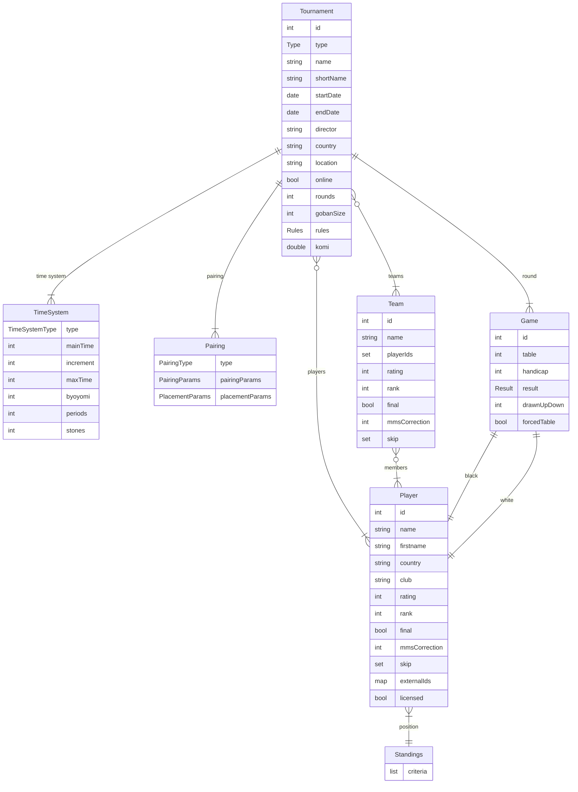

# Pairgoth Reference Documentation

[TOC]

## Pairgoth Model

*Exhaustive classes and fields diagram.*

### Entity Relationship Diagram

```mermaid
erDiagram

  %% entities

  Tournament {
    int id
    Type type
    string name
    string shortName
    date startDate
    date endDate
    string director
    string country
    string location
    bool online
    int rounds
    int gobanSize
    Rules rules
    double komi
  }

  TimeSystem {
    TimeSystemType type
    int mainTime
    int increment
    int maxTime
    int byoyomi
    int periods
    int stones
  }

  Pairing {
    PairingType type
    PairingParams pairingParams
    PlacementParams placementParams
  }

  Game {
    int id
    int table
    int handicap
    Result result
    int drawnUpDown
    bool forcedTable
  }

  Player {
    int id
    string name
    string firstname
    string country
    string club
    int rating
    int rank
    bool final
    int mmsCorrection
    set skip
    map externalIds
    bool licensed
  }

  Team {
    int id
    string name
    set playerIds
    int rating
    int rank
    bool final
    int mmsCorrection
    set skip
  }

  Standings {
    list criteria
  }

  %% relationships

  Tournament ||--|{ TimeSystem: "time system"
  Tournament ||--|{ Pairing: "pairing"
  Tournament ||--|{ Game: "round"
  Tournament }o--|{ Player: "players"
  Tournament }o--|{ Team: "teams"
  Team }o--|{ Player: "members"
  Game ||--|| Player: "black"
  Game ||--|| Player: "white"
  Player }|--|| Standings: "position"

```

### Tournament

Sealed class hierarchy for different tournament formats.

| Field | Type | Description |
|-------|------|-------------|
| id | int | Tournament identifier |
| type | Type | Tournament format |
| name | string | Full tournament name |
| shortName | string | Abbreviated name |
| startDate | date | Start date |
| endDate | date | End date |
| director | string | Tournament director |
| country | string | Country code (default: "fr") |
| location | string | Venue location |
| online | bool | Is online tournament |
| rounds | int | Total number of rounds |
| gobanSize | int | Board size (default: 19) |
| rules | Rules | Scoring rules |
| komi | double | Komi value (default: 7.5) |
| timeSystem | TimeSystem | Time control |
| pairing | Pairing | Pairing system |
| tablesExclusion | list | Table exclusion rules per round |

#### Tournament Types

| Type | Players/Team | Description |
|------|--------------|-------------|
| INDIVIDUAL | 1 | Individual players |
| PAIRGO | 2 | Pair Go (alternating) |
| RENGO2 | 2 | Rengo with 2 players |
| RENGO3 | 3 | Rengo with 3 players |
| TEAM2 | 2 | Team with 2 boards |
| TEAM3 | 3 | Team with 3 boards |
| TEAM4 | 4 | Team with 4 boards |
| TEAM5 | 5 | Team with 5 boards |

#### Rules

- `AGA` - American Go Association
- `FRENCH` - French Go Association
- `JAPANESE` - Japanese rules
- `CHINESE` - Chinese rules

### Player

Individual tournament participant.

| Field | Type | Description |
|-------|------|-------------|
| id | int | Player identifier |
| name | string | Last name |
| firstname | string | First name |
| country | string | Country code |
| club | string | Club affiliation |
| rating | int | EGF-style rating |
| rank | int | Rank (-30=30k to 8=9D) |
| final | bool | Is registration confirmed |
| mmsCorrection | int | MacMahon score correction |
| skip | set | Skipped round numbers |
| externalIds | map | External IDs (AGA, EGF, FFG) |
| licensed | bool | FFG licence up to date (FR snapshot); absent = unknown |

### Team

Team participant (for team tournaments).

| Field | Type | Description |
|-------|------|-------------|
| id | int | Team identifier |
| name | string | Team name |
| playerIds | set | Member player IDs |
| rating | int | Computed from members |
| rank | int | Computed from members |
| final | bool | Is registration confirmed |
| mmsCorrection | int | MacMahon score correction |
| skip | set | Skipped round numbers |

### Game

Single game in a round.

| Field | Type | Description |
|-------|------|-------------|
| id | int | Game identifier |
| table | int | Table number (0 = unpaired) |
| white | int | White player ID (0 = bye) |
| black | int | Black player ID (0 = bye) |
| handicap | int | Handicap stones |
| result | Result | Game outcome |
| drawnUpDown | int | DUDD value |
| forcedTable | bool | Is table manually assigned |

#### Result

| Code | Description |
|------|-------------|
| ? | Unknown (not yet played) |
| w | White won |
| b | Black won |
| = | Jigo (draw) |
| X | Cancelled |
| # | Both win (unusual) |
| 0 | Both lose (unusual) |

### TimeSystem

Time control configuration.

| Field | Type | Description |
|-------|------|-------------|
| type | TimeSystemType | System type |
| mainTime | int | Main time in seconds |
| increment | int | Fischer increment |
| maxTime | int | Fischer max time |
| byoyomi | int | Byoyomi time per period |
| periods | int | Number of byoyomi periods |
| stones | int | Stones per period (Canadian) |

#### TimeSystemType

| Type | Description |
|------|-------------|
| CANADIAN | Canadian byoyomi |
| JAPANESE | Japanese byoyomi |
| FISCHER | Fischer increment |
| SUDDEN_DEATH | No overtime |

### Pairing

Pairing systems and their parameters are documented in the [pairing documentation](pairing).

### Placement Criteria

Tiebreak criteria for standings, in order of priority.

#### Score-based

| Criterion | Description |
|-----------|-------------|
| NBW | Number of wins |
| MMS | MacMahon score |
| STS | Strasbourg score |
| CPS | Cup score |
| SCOREX | Congress score |

#### Opponent-based (W = wins, M = MMS)

| Criterion | Description |
|-----------|-------------|
| SOSW / SOSM | Sum of opponent scores |
| SOSWM1 / SOSMM1 | SOS minus worst |
| SOSWM2 / SOSMM2 | SOS minus two worst |
| SODOSW / SODOSM | Sum of defeated opponent scores |
| SOSOSW / SOSOSM | Sum of opponent SOS |
| CUSSW / CUSSM | Cumulative score sum |

#### Other

| Criterion | Description |
|-----------|-------------|
| CATEGORY | Player category |
| RANK | Player rank |
| RATING | Player rating |
| EGFDC | Direct comparison, EGF rules (see below) |
| DC | Direct confrontation (see below) |
| SDC | Simplified direct confrontation (see below) |
| EXT | Exploits attempted |
| EXR | Exploits successful |

#### Direct confrontation (EGFDC, DC and SDC)

The three criteria all order players that are tied on every criterion placed before them, using only the games those tied players played against each other. They differ in what they make of those games — **EGFDC** implements the European Go Federation's definition, DC and SDC reproduce OpenGotha's.

- **EGFDC** is the number of wins over the intra-group games, a jigo counting a half point and the total being rounded down (the EGF rounds down accumulated values in a Swiss or a Mac-Mahon, tie-breaks included). Handicap games count. The criterion only applies if the tied players all played the *same number* of games against each other, as the EGF prescribes for Swiss and Mac-Mahon tournaments; otherwise the whole group scores 0. If it leaves players tied, it is applied again among them alone, refining its first verdict rather than replacing it.
- **DC** ranks the tied group by "who beat whom", counting only even games with a plain win/loss result (when two players met several times their results are summed, so a 1-1 split cancels out). Victory cycles (A beats B, B beats C, C beats A) are neutralized: wins inside a cycle are ignored, and every member of the cycle inherits the cycle's collective wins and losses against the rest of the group, so beating one member of a cycle counts as beating them all. The group is then filled from the bottom: among the players left with no remaining victory, the ones ranked lowest by the criteria placed *after* DC go last. The DC number itself is only meaningful within the group (higher is better).
- **SDC** uses the same games as DC, and applies only when every pair of tied players has a decided result between them; each player then scores the number of tied opponents they beat. Otherwise everyone in the group scores 0.

Only one of the three should appear in the placement criteria. EGFDC being specific to pairgoth, an OpenGotha export naming it will not be understood on the OpenGotha side.

The standings tab offers four placement-criterion slots; a slot left on NONE is ignored.

### External Databases

Player IDs can be linked to external rating databases:

| Database | Description |
|----------|-------------|
| AGA | American Go Association |
| EGF | European Go Federation |
| FFG | French Go Association |

## Connecting to an event website

Pairgoth can work alone, but it is designed to plug into an "event" website (a club page, a federation
site, or a large platform like the EGC). Three typical setups, simplest first:

- **Publish from a laptop** — you run pairgoth locally and *publish* pairings, results and standings to
  your event page with the Publish / Sync buttons. Nothing else to set up beyond the website's address.
- **Single hosted event** — pairgoth runs on a server and your event site drives it (registers players,
  reads pairings/results/standings), behind one shared password.
- **Multi-event platform (EGC-scale)** — the event site signs operators in and controls which
  tournaments each may see. This is the only setup with real complexity, and **small organizers never
  need it.**

Configuration for each — addresses, secrets, single sign-on — is in the
[technical documentation](technical#deployment-profiles).
