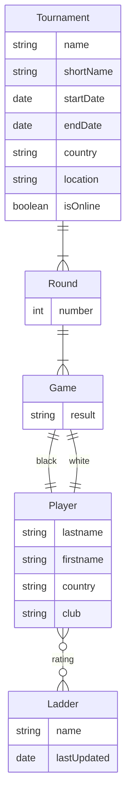

# PairGoth model

## Entity Relationship Diagram

```mermaid
erDiagram

  %% entities

  Tournament {
    string name
    string shortName
    date startDate
    date endDate
    string country
    string location
    boolean isOnline
  }

  Round {
    int number
  }

  Game {
    string result
  }

  Player {
    string lastname
    string firstname
    string country
    string club
  }

  Ladder {
    string name
    date lastUpdated
  }
  
  %% relationships

  Tournament ||--|{ Round: ""
  Round ||--|{ Game: ""
  Game ||--|| Player: "black"
  Game ||--|| Player: "white"
  Player }o--o{ Ladder: "rating"
  
```

